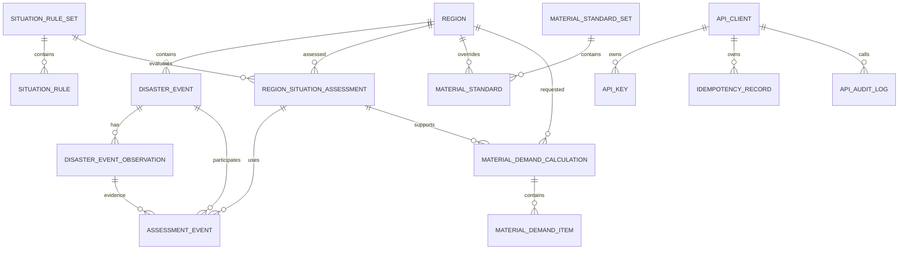

# 区域洪水情景态势与物资需求开放 API 设计

- **状态：** 待评审
- **日期：** 2026-08-21
- **数据库：** MySQL 8.4 LTS / InnoDB
- **服务形态：** Spring Boot 模块化单体
- **接口鉴权：** API Key

## 1. 目标与范围

系统向外部调用方开放两类能力：

1. 区域洪水情景态势
   - 新增洪水灾害事件和事件观测。
   - 按区域、事件时间区间查询灾害事件。
   - 接收一个区域当前时刻的全部洪水事件，将事件和观测导入数据库，计算并保存区域态势等级。
   - 按区域、评估时间区间查询已经保存的区域态势，等级为 `LOW`、`MEDIUM`、`HIGH`。
2. 物资需求
   - 使用调用方直接提供的区域、态势等级、保障时长和人口数据计算物资。
   - 按区域和时间区间查询数据库中最新的区域态势，再计算物资。

MVP 不包含 GIS、PostGIS、水动力模拟、地图展示、自动气象/水文数据采集、消息队列和异步任务。全部计算接口同步完成。

## 2. 已确认的架构决策

- 数据库使用 MySQL 8.4 LTS，所有表使用 InnoDB。
- 字符集使用 `utf8mb4`，排序规则使用 `utf8mb4_0900_ai_ci`。
- API 时间使用 ISO 8601 且必须包含时区偏移；应用转换为 UTC 后使用 `DATETIME(3)` 保存。
- 数据库表使用 `BIGINT UNSIGNED AUTO_INCREMENT` 内部主键；API 暴露应用生成的 `VARCHAR(32)` 公共编号。
- 灾害事件与时序观测分表保存；新观测不得覆盖历史观测。
- 区域态势计算接口在同一个事务内导入事件、保存观测、计算态势并保存结果。
- 历史态势查询读取已经保存的结果，不因后来修改规则而重新计算。
- 物资标准由业务方提供并版本化；已激活版本不得原地修改。
- 数据库态势计算的受灾人口按事件求和。因为 MVP 没有 GIS 去重能力，多事件时响应必须给出潜在人口重复统计警告。

## 3. 领域模型与数据流



核心写入流程：

```text
外部事件列表
  -> 校验区域、事件和观测
  -> 按 sourceSystem + externalEventId 新增或更新事件
  -> 按 eventId + externalObservationId/observedAt 幂等保存观测
  -> 读取当前激活的态势规则版本
  -> 计算每个事件等级
  -> 聚合区域等级及人口数据
  -> 保存区域态势及其事件证据
  -> 提交事务并返回
```

## 4. 数据库设计

### 4.1 通用字段约定

| 约定 | 说明 |
|---|---|
| 主键 | `id BIGINT UNSIGNED AUTO_INCREMENT` |
| 公共编号 | `public_id VARCHAR(32)`，唯一，API 使用该字段 |
| 时间 | `DATETIME(3)`，统一保存 UTC |
| 人口/数量 | 人口使用 `BIGINT UNSIGNED`，物资数量使用 `DECIMAL(20,4)` |
| 测量值 | 使用 `DECIMAL`，不使用 `FLOAT/DOUBLE` |
| 扩展快照 | 使用 MySQL 原生 `JSON` |
| 删除策略 | 核心业务记录不物理删除；通过状态字段停用或撤销 |
| 审计时间 | `created_at` 必填，允许更新的表增加 `updated_at` |

数据库内部的 `region.id` 是数值主键；API 中名为 `regionId` 的字段对应稳定的 `region.region_code`，不会向外暴露数值主键。

数据库不创建 `FOREIGN KEY` 约束。所有 `*_id` 关联字段均为逻辑引用，
由应用层在同一事务内完成引用存在性校验、删除前依赖检查和孤立数据监控。
所有逻辑引用字段继续创建普通索引；所有表显式使用：

```sql
ENGINE=InnoDB DEFAULT CHARSET=utf8mb4 COLLATE=utf8mb4_0900_ai_ci
```

### 4.2 `region` 区域表

| 字段 | 类型 | 约束 | 说明 |
|---|---|---|---|
| `id` | BIGINT UNSIGNED | PK, AUTO_INCREMENT | 内部主键 |
| `region_code` | VARCHAR(64) | NOT NULL, UNIQUE | 稳定区域编码 |
| `region_name` | VARCHAR(128) | NOT NULL | 区域名称，允许重名 |
| `parent_id` | BIGINT UNSIGNED | NULL, 逻辑引用 | 上级区域 |
| `region_level` | VARCHAR(32) | NOT NULL | PROVINCE/CITY/DISTRICT/OTHER |
| `status` | VARCHAR(16) | NOT NULL | ACTIVE/INACTIVE |
| `created_at` | DATETIME(3) | NOT NULL | 创建时间 |
| `updated_at` | DATETIME(3) | NOT NULL | 更新时间 |

索引：

- `uk_region_code(region_code)`
- `idx_region_name(region_name)`
- `idx_region_parent(parent_id)`

区域名称查询可能返回多条；应用不得自动选择，必须返回 `REGION_NAME_AMBIGUOUS`。

### 4.3 `api_client` 外部调用方

| 字段 | 类型 | 约束 | 说明 |
|---|---|---|---|
| `id` | BIGINT UNSIGNED | PK, AUTO_INCREMENT | 主键 |
| `client_code` | VARCHAR(64) | NOT NULL, UNIQUE | 调用方编码 |
| `client_name` | VARCHAR(128) | NOT NULL | 调用方名称 |
| `organization_name` | VARCHAR(256) | NULL | 组织名称 |
| `status` | VARCHAR(16) | NOT NULL | ACTIVE/SUSPENDED/REVOKED |
| `rate_limit_per_minute` | INT UNSIGNED | NOT NULL | 每分钟限额 |
| `allowed_ips` | JSON | NULL | 可选 CIDR 列表；空值表示不限制 |
| `created_at` | DATETIME(3) | NOT NULL | 创建时间 |
| `updated_at` | DATETIME(3) | NOT NULL | 更新时间 |

### 4.4 `api_key` API 密钥

| 字段 | 类型 | 约束 | 说明 |
|---|---|---|---|
| `id` | BIGINT UNSIGNED | PK, AUTO_INCREMENT | 主键 |
| `client_id` | BIGINT UNSIGNED | NOT NULL, 逻辑引用 | 所属调用方 |
| `key_prefix` | VARCHAR(32) | NOT NULL, UNIQUE | 可公开的 Key 定位前缀 |
| `secret_hash` | BINARY(32) | NOT NULL | HMAC-SHA256 结果，不保存明文 |
| `scopes` | JSON | NOT NULL | 权限列表 |
| `status` | VARCHAR(16) | NOT NULL | ACTIVE/REVOKED/EXPIRED |
| `expires_at` | DATETIME(3) | NOT NULL | 到期时间 |
| `last_used_at` | DATETIME(3) | NULL | 最近调用时间 |
| `revoked_at` | DATETIME(3) | NULL | 撤销时间 |
| `created_at` | DATETIME(3) | NOT NULL | 创建时间 |

索引：`idx_api_key_client_status(client_id, status)`。

### 4.5 `disaster_event` 灾害事件

| 字段 | 类型 | 约束 | 说明 |
|---|---|---|---|
| `id` | BIGINT UNSIGNED | PK, AUTO_INCREMENT | 内部主键 |
| `public_id` | VARCHAR(32) | NOT NULL, UNIQUE | API 事件编号 |
| `external_event_id` | VARCHAR(128) | NOT NULL | 外部系统事件编号 |
| `source_system` | VARCHAR(64) | NOT NULL | 来源系统 |
| `region_id` | BIGINT UNSIGNED | NOT NULL, 逻辑引用 | 所属区域 |
| `event_type` | VARCHAR(32) | NOT NULL | 洪水事件类型 |
| `event_name` | VARCHAR(256) | NOT NULL | 事件名称 |
| `start_time` | DATETIME(3) | NOT NULL | 开始时间 |
| `end_time` | DATETIME(3) | NULL | 结束时间；持续中为空 |
| `status` | VARCHAR(16) | NOT NULL | ONGOING/ENDED/CANCELLED |
| `created_by_client_id` | BIGINT UNSIGNED | NOT NULL, 逻辑引用 | 首次导入方 |
| `created_at` | DATETIME(3) | NOT NULL | 创建时间 |
| `updated_at` | DATETIME(3) | NOT NULL | 更新时间 |

事件类型：

- `RIVER_FLOOD`
- `URBAN_WATERLOGGING`
- `FLASH_FLOOD`
- `EMBANKMENT_BREACH`
- `DAM_BREAK`
- `OTHER`

约束与索引：

- `UNIQUE(source_system, external_event_id)`
- `INDEX(region_id, start_time, end_time)`
- `INDEX(region_id, status, start_time)`
- `CHECK(end_time IS NULL OR end_time >= start_time)`

事件持续时长不单独存储，计算规则为：

```text
ENDED: endTime - startTime
ONGOING: assessmentTime - startTime
```

### 4.6 `disaster_event_observation` 事件时序观测

| 字段 | 类型 | 约束 | 说明 |
|---|---|---|---|
| `id` | BIGINT UNSIGNED | PK, AUTO_INCREMENT | 主键 |
| `public_id` | VARCHAR(32) | NOT NULL, UNIQUE | API 观测编号 |
| `event_id` | BIGINT UNSIGNED | NOT NULL, 逻辑引用 | 所属事件 |
| `external_observation_id` | VARCHAR(128) | NULL | 外部观测编号 |
| `observed_at` | DATETIME(3) | NOT NULL | 观测时刻 |
| `rainfall_24h_mm` | DECIMAL(10,2) | NULL | 24 小时降雨量 |
| `water_level_over_warning_m` | DECIMAL(10,3) | NULL | 超警戒水位 |
| `max_water_depth_m` | DECIMAL(10,3) | NULL | 最大积水/淹没深度 |
| `affected_area_km2` | DECIMAL(14,4) | NULL | 受影响面积，非 GIS 计算 |
| `affected_population` | BIGINT UNSIGNED | NOT NULL DEFAULT 0 | 受灾人数 |
| `trapped_population` | BIGINT UNSIGNED | NOT NULL DEFAULT 0 | 受困人数 |
| `evacuated_population` | BIGINT UNSIGNED | NOT NULL DEFAULT 0 | 转移安置人数 |
| `vulnerable_population` | BIGINT UNSIGNED | NOT NULL DEFAULT 0 | 老幼病残孕等特殊人群 |
| `injured_population` | BIGINT UNSIGNED | NOT NULL DEFAULT 0 | 受伤人数 |
| `missing_population` | BIGINT UNSIGNED | NOT NULL DEFAULT 0 | 失踪人数 |
| `death_population` | BIGINT UNSIGNED | NOT NULL DEFAULT 0 | 死亡人数 |
| `damaged_households` | BIGINT UNSIGNED | NOT NULL DEFAULT 0 | 受损户数 |
| `collapsed_houses` | BIGINT UNSIGNED | NOT NULL DEFAULT 0 | 倒塌房屋数 |
| `road_interruptions` | INT UNSIGNED | NOT NULL DEFAULT 0 | 道路中断点数量 |
| `critical_facilities_affected` | INT UNSIGNED | NOT NULL DEFAULT 0 | 受影响重要设施数 |
| `power_outage_households` | BIGINT UNSIGNED | NOT NULL DEFAULT 0 | 停电户数 |
| `source_payload` | JSON | NULL | 原始请求快照，用于追溯 |
| `created_at` | DATETIME(3) | NOT NULL | 创建时间 |

约束与索引：

- `UNIQUE(event_id, external_observation_id)`；MySQL 允许多个 NULL。
- `UNIQUE(event_id, observed_at)`；同一事件同一时刻只能有一个有效观测。
- 所有测量值和人口值不得小于零。
- 观测时间不得早于事件开始时间。

相同唯一键且请求内容相同视为幂等成功；内容不同返回 `OBSERVATION_CONFLICT`。

### 4.7 `situation_rule_set` 区域态势规则版本

| 字段 | 类型 | 约束 | 说明 |
|---|---|---|---|
| `id` | BIGINT UNSIGNED | PK, AUTO_INCREMENT | 主键 |
| `version` | VARCHAR(64) | NOT NULL, UNIQUE | 规则版本 |
| `status` | VARCHAR(16) | NOT NULL | DRAFT/ACTIVE/RETIRED |
| `aggregation_strategy` | VARCHAR(32) | NOT NULL | MVP 固定 HIGHEST_EVENT_LEVEL |
| `medium_to_high_count` | INT UNSIGNED | NULL | 中等级事件升级高等级的数量；空表示关闭 |
| `effective_from` | DATETIME(3) | NOT NULL | 生效时间 |
| `effective_to` | DATETIME(3) | NULL | 失效时间 |
| `created_at` | DATETIME(3) | NOT NULL | 创建时间 |

规则集激活后不可修改；变更必须新建版本。应用层在激活事务中保证同一时刻只有一个有效规则集。

### 4.8 `situation_rule` 事件指标规则

| 字段 | 类型 | 约束 | 说明 |
|---|---|---|---|
| `id` | BIGINT UNSIGNED | PK, AUTO_INCREMENT | 主键 |
| `rule_set_id` | BIGINT UNSIGNED | NOT NULL, 逻辑引用 | 所属规则集 |
| `rule_code` | VARCHAR(64) | NOT NULL | 规则编码 |
| `event_type` | VARCHAR(32) | NULL | 空表示适用全部洪水类型 |
| `metric_code` | VARCHAR(64) | NOT NULL | 指标字段编码 |
| `comparison_direction` | VARCHAR(8) | NOT NULL | GTE/LTE |
| `medium_threshold` | DECIMAL(20,4) | NULL | 中等级阈值 |
| `high_threshold` | DECIMAL(20,4) | NULL | 高等级阈值 |
| `priority` | INT | NOT NULL DEFAULT 0 | 匹配展示顺序 |
| `enabled` | TINYINT(1) | NOT NULL DEFAULT 1 | 是否启用 |
| `created_at` | DATETIME(3) | NOT NULL | 创建时间 |

唯一键：`UNIQUE(rule_set_id, rule_code)`。

允许的 `metric_code` 对应观测字段及事件派生字段，例如：

- `DURATION_HOURS`
- `RAINFALL_24H_MM`
- `WATER_LEVEL_OVER_WARNING_M`
- `MAX_WATER_DEPTH_M`
- `AFFECTED_AREA_KM2`
- `AFFECTED_POPULATION`
- `TRAPPED_POPULATION`
- `EVACUATED_POPULATION`
- `INJURED_POPULATION`
- `MISSING_POPULATION`
- `DEATH_POPULATION`
- `COLLAPSED_HOUSES`
- `ROAD_INTERRUPTIONS`
- `CRITICAL_FACILITIES_AFFECTED`

### 4.9 `region_situation_assessment` 区域态势评估

| 字段 | 类型 | 约束 | 说明 |
|---|---|---|---|
| `id` | BIGINT UNSIGNED | PK, AUTO_INCREMENT | 主键 |
| `public_id` | VARCHAR(32) | NOT NULL, UNIQUE | API 评估编号 |
| `region_id` | BIGINT UNSIGNED | NOT NULL, 逻辑引用 | 区域 |
| `assessment_time` | DATETIME(3) | NOT NULL | 评估时刻 |
| `situation_level` | VARCHAR(16) | NOT NULL | LOW/MEDIUM/HIGH |
| `active_event_count` | INT UNSIGNED | NOT NULL | 参与计算的事件数 |
| `affected_population` | BIGINT UNSIGNED | NOT NULL DEFAULT 0 | 汇总受灾人数 |
| `trapped_population` | BIGINT UNSIGNED | NOT NULL DEFAULT 0 | 汇总受困人数 |
| `evacuated_population` | BIGINT UNSIGNED | NOT NULL DEFAULT 0 | 汇总转移人数 |
| `vulnerable_population` | BIGINT UNSIGNED | NOT NULL DEFAULT 0 | 汇总特殊人群 |
| `rule_set_id` | BIGINT UNSIGNED | NOT NULL, 逻辑引用 | 使用的规则集 |
| `rule_version` | VARCHAR(64) | NOT NULL | 规则版本快照 |
| `source_type` | VARCHAR(32) | NOT NULL | DIRECT_IMPORT/DATABASE |
| `input_snapshot` | JSON | NOT NULL | 标准化后的计算输入快照 |
| `warnings` | JSON | NULL | 数据质量警告 |
| `created_by_client_id` | BIGINT UNSIGNED | NOT NULL, 逻辑引用 | 调用方 |
| `created_at` | DATETIME(3) | NOT NULL | 创建时间 |

索引：

- `INDEX(region_id, assessment_time DESC)`
- `INDEX(region_id, situation_level, assessment_time DESC)`
- `INDEX(created_by_client_id, created_at DESC)`

### 4.10 `region_situation_assessment_event` 评估事件证据

| 字段 | 类型 | 约束 | 说明 |
|---|---|---|---|
| `assessment_id` | BIGINT UNSIGNED | PK, 逻辑引用 | 评估 |
| `event_id` | BIGINT UNSIGNED | PK, 逻辑引用 | 事件 |
| `observation_id` | BIGINT UNSIGNED | NOT NULL, 逻辑引用 | 使用的观测 |
| `event_level` | VARCHAR(16) | NOT NULL | LOW/MEDIUM/HIGH |
| `duration_hours` | DECIMAL(12,3) | NOT NULL | 评估时刻的事件时长 |
| `matched_rule_codes` | JSON | NOT NULL | 命中的规则编码 |
| `created_at` | DATETIME(3) | NOT NULL | 创建时间 |

主键：`PRIMARY KEY(assessment_id, event_id)`。

### 4.11 `material_standard_set` 物资标准版本

| 字段 | 类型 | 约束 | 说明 |
|---|---|---|---|
| `id` | BIGINT UNSIGNED | PK, AUTO_INCREMENT | 主键 |
| `version` | VARCHAR(64) | NOT NULL, UNIQUE | 标准版本 |
| `status` | VARCHAR(16) | NOT NULL | DRAFT/ACTIVE/RETIRED |
| `effective_from` | DATETIME(3) | NOT NULL | 生效时间 |
| `effective_to` | DATETIME(3) | NULL | 失效时间 |
| `description` | VARCHAR(512) | NULL | 标准说明和来源 |
| `created_at` | DATETIME(3) | NOT NULL | 创建时间 |

### 4.12 `material_standard` 物资计算标准

| 字段 | 类型 | 约束 | 说明 |
|---|---|---|---|
| `id` | BIGINT UNSIGNED | PK, AUTO_INCREMENT | 主键 |
| `standard_set_id` | BIGINT UNSIGNED | NOT NULL, 逻辑引用 | 标准版本 |
| `region_id` | BIGINT UNSIGNED | NULL, 逻辑引用 | 区域专用标准；空表示全局 |
| `region_scope_id` | BIGINT UNSIGNED | GENERATED | `IFNULL(region_id, 0)`，用于唯一键 |
| `situation_level` | VARCHAR(16) | NOT NULL | LOW/MEDIUM/HIGH |
| `material_code` | VARCHAR(64) | NOT NULL | 物资编码 |
| `material_name` | VARCHAR(128) | NOT NULL | 物资名称 |
| `unit` | VARCHAR(32) | NOT NULL | 计量单位 |
| `population_basis` | VARCHAR(32) | NOT NULL | AFFECTED/TRAPPED/EVACUATED/VULNERABLE/FIXED |
| `per_person_per_day` | DECIMAL(20,6) | NULL | 人均每日标准 |
| `fixed_base_quantity` | DECIMAL(20,4) | NULL | FIXED 模式固定基础量 |
| `level_factor` | DECIMAL(10,4) | NOT NULL DEFAULT 1 | 等级修正系数 |
| `reserve_ratio` | DECIMAL(10,6) | NOT NULL DEFAULT 0 | 安全储备比例 |
| `package_size` | DECIMAL(20,4) | NOT NULL DEFAULT 1 | 包装取整单位 |
| `minimum_quantity` | DECIMAL(20,4) | NOT NULL DEFAULT 0 | 最小调拨量 |
| `created_at` | DATETIME(3) | NOT NULL | 创建时间 |

生成列和唯一键：

```sql
region_scope_id BIGINT UNSIGNED
  GENERATED ALWAYS AS (IFNULL(region_id, 0)) STORED,
UNIQUE KEY uk_material_standard
  (standard_set_id, region_scope_id, situation_level, material_code)
```

区域专用标准优先于全局标准。标准集中同一作用域、等级和物资只能有一条记录。

### 4.13 `material_demand_calculation` 物资计算主表

| 字段 | 类型 | 约束 | 说明 |
|---|---|---|---|
| `id` | BIGINT UNSIGNED | PK, AUTO_INCREMENT | 主键 |
| `public_id` | VARCHAR(32) | NOT NULL, UNIQUE | API 计算编号 |
| `region_id` | BIGINT UNSIGNED | NOT NULL, 逻辑引用 | 区域 |
| `assessment_id` | BIGINT UNSIGNED | NULL, 逻辑引用 | 数据库模式引用的态势评估 |
| `source_type` | VARCHAR(32) | NOT NULL | DIRECT/DATABASE |
| `situation_level` | VARCHAR(16) | NOT NULL | LOW/MEDIUM/HIGH |
| `supply_duration_hours` | DECIMAL(12,3) | NOT NULL | 保障时长 |
| `supply_days` | INT UNSIGNED | NOT NULL | 向上取整的保障天数 |
| `affected_population` | BIGINT UNSIGNED | NOT NULL DEFAULT 0 | 受灾人数 |
| `trapped_population` | BIGINT UNSIGNED | NOT NULL DEFAULT 0 | 受困人数 |
| `evacuated_population` | BIGINT UNSIGNED | NOT NULL DEFAULT 0 | 转移人数 |
| `vulnerable_population` | BIGINT UNSIGNED | NOT NULL DEFAULT 0 | 特殊人群 |
| `standard_set_id` | BIGINT UNSIGNED | NOT NULL, 逻辑引用 | 使用的标准集 |
| `standard_version` | VARCHAR(64) | NOT NULL | 标准版本快照 |
| `input_snapshot` | JSON | NOT NULL | 计算输入快照 |
| `warnings` | JSON | NULL | 警告 |
| `created_by_client_id` | BIGINT UNSIGNED | NOT NULL, 逻辑引用 | 调用方 |
| `created_at` | DATETIME(3) | NOT NULL | 创建时间 |

索引：

- `INDEX(region_id, created_at DESC)`
- `INDEX(assessment_id)`
- `INDEX(created_by_client_id, created_at DESC)`

### 4.14 `material_demand_item` 物资计算明细

| 字段 | 类型 | 约束 | 说明 |
|---|---|---|---|
| `id` | BIGINT UNSIGNED | PK, AUTO_INCREMENT | 主键 |
| `calculation_id` | BIGINT UNSIGNED | NOT NULL, 逻辑引用 | 物资计算 |
| `material_code` | VARCHAR(64) | NOT NULL | 物资编码 |
| `material_name` | VARCHAR(128) | NOT NULL | 物资名称快照 |
| `unit` | VARCHAR(32) | NOT NULL | 单位 |
| `population_basis` | VARCHAR(32) | NOT NULL | 人口口径 |
| `basis_population` | BIGINT UNSIGNED | NOT NULL | 实际使用人数 |
| `gross_demand` | DECIMAL(20,4) | NOT NULL | 含储备和包装取整的毛需求 |
| `current_inventory` | DECIMAL(20,4) | NOT NULL DEFAULT 0 | 当前库存 |
| `net_demand` | DECIMAL(20,4) | NOT NULL | 净需求 |
| `formula_snapshot` | JSON | NOT NULL | 标准参数和计算过程 |
| `created_at` | DATETIME(3) | NOT NULL | 创建时间 |

唯一键：`UNIQUE(calculation_id, material_code)`。

### 4.15 `idempotency_record` 幂等记录

| 字段 | 类型 | 约束 | 说明 |
|---|---|---|---|
| `id` | BIGINT UNSIGNED | PK, AUTO_INCREMENT | 主键 |
| `client_id` | BIGINT UNSIGNED | NOT NULL, 逻辑引用 | 调用方 |
| `operation_code` | VARCHAR(128) | NOT NULL | HTTP 方法与规范化路由模板组成的操作编码 |
| `idempotency_key` | VARCHAR(128) | NOT NULL | 调用方提供的幂等键 |
| `request_hash` | BINARY(32) | NOT NULL | 规范化请求 SHA-256 |
| `resource_type` | VARCHAR(64) | NOT NULL | EVENT/OBSERVATION/ASSESSMENT/MATERIAL |
| `resource_public_id` | VARCHAR(32) | NULL | 已创建资源编号 |
| `response_status` | SMALLINT UNSIGNED | NULL | HTTP 状态 |
| `response_body` | JSON | NULL | 成功响应快照 |
| `expires_at` | DATETIME(3) | NOT NULL | 幂等窗口截止时间 |
| `created_at` | DATETIME(3) | NOT NULL | 创建时间 |

唯一键：`UNIQUE(client_id, operation_code, idempotency_key)`。同一操作中相同 Key、不同请求摘要返回 `IDEMPOTENCY_CONFLICT`；不同操作允许复用相同 Key。

### 4.16 `api_audit_log` 接口审计日志

| 字段 | 类型 | 约束 | 说明 |
|---|---|---|---|
| `id` | BIGINT UNSIGNED | PK, AUTO_INCREMENT | 主键 |
| `request_id` | VARCHAR(64) | NOT NULL, UNIQUE | 请求追踪编号 |
| `client_id` | BIGINT UNSIGNED | NULL, 逻辑引用 | 调用方；认证失败时为空 |
| `api_key_id` | BIGINT UNSIGNED | NULL, 逻辑引用 | 使用的 Key |
| `http_method` | VARCHAR(8) | NOT NULL | HTTP 方法 |
| `request_path` | VARCHAR(512) | NOT NULL | 接口路径 |
| `response_status` | SMALLINT UNSIGNED | NOT NULL | HTTP 状态 |
| `error_code` | VARCHAR(64) | NULL | 业务错误码 |
| `duration_ms` | INT UNSIGNED | NOT NULL | 耗时 |
| `remote_ip` | VARCHAR(64) | NOT NULL | 来源 IP |
| `request_hash` | BINARY(32) | NULL | 请求摘要，不保存 API Key |
| `created_at` | DATETIME(3) | NOT NULL | 创建时间 |

索引：

- `INDEX(client_id, created_at DESC)`
- `INDEX(response_status, created_at DESC)`
- `INDEX(error_code, created_at DESC)`

## 5. 区域态势计算规则

### 5.1 事件等级

对每个事件使用本次请求中的观测记录，并计算事件在 `assessmentTime` 的持续时长。规则引擎读取生效规则集：

1. 任一指标命中高等级阈值，事件为 `HIGH`。
2. 未命中高等级且任一指标命中中等级阈值，事件为 `MEDIUM`。
3. 其余事件为 `LOW`。
4. 只有状态为 `ONGOING` 且 `observedAt <= assessmentTime` 的事件参与当前态势。

业务阈值以数据库规则为准；代码只实现比较、最高等级选择和版本管理。

### 5.2 区域等级

MVP 使用 `HIGHEST_EVENT_LEVEL`：

```text
HIGH > MEDIUM > LOW
区域等级 = 所有有效事件等级中的最高值
```

如果激活规则集配置了 `medium_to_high_count`，当中等级事件数量达到该值时区域升级为 `HIGH`。

### 5.3 人口聚合

分别求和：

- `affectedPopulation`
- `trappedPopulation`
- `evacuatedPopulation`
- `vulnerablePopulation`

当参与评估的事件超过一个且任一人口字段大于零时，响应和持久化结果增加：

```json
{
  "code": "POSSIBLE_POPULATION_OVERLAP",
  "message": "MVP 未使用 GIS，跨事件人口可能存在重复统计"
}
```

## 6. 物资计算规则

保障天数：

```text
supplyDays = ceil(supplyDurationHours / 24)
```

人口型物资：

```text
rawDemand = basisPopulation * perPersonPerDay * supplyDays
adjustedDemand = rawDemand * levelFactor * (1 + reserveRatio)
grossDemand = max(minimumQuantity,
                  ceil(adjustedDemand / packageSize) * packageSize)
netDemand = max(0, grossDemand - currentInventory)
```

固定型物资：

```text
adjustedDemand = fixedBaseQuantity * levelFactor * (1 + reserveRatio)
grossDemand = max(minimumQuantity,
                  ceil(adjustedDemand / packageSize) * packageSize)
netDemand = max(0, grossDemand - currentInventory)
```

库存单位必须与物资标准单位一致，否则返回 `UNIT_MISMATCH`。

## 7. API 通用约定

### 7.1 基础路径与请求头

基础路径：`/openapi/v1`

```http
X-API-Key: flood_live_<keyPrefix>.<secret>
X-Request-Id: optional-client-request-id
Idempotency-Key: required-for-write-operations
Content-Type: application/json
Accept: application/json, application/problem+json
```

- API Key 只能通过请求头传递。
- 所有写接口要求 `Idempotency-Key`。
- 服务端没有收到 `X-Request-Id` 时自行生成。
- API Key 权限分为：
  - `event:write`
  - `event:read`
  - `situation:calculate`
  - `situation:read`
  - `material:calculate`

MVP 的区域灾害数据属于共享决策数据，不按调用方进行租户隔离：持有相应读取权限的调用方可以查询所有区域的聚合事件和态势数据。`created_by_client_id` 仅用于审计，不作为查询过滤条件。接口禁止传输姓名、证件号、手机号等个人明细数据；如果未来需要调用方数据隔离，应在独立版本中增加数据域授权，不能通过静默改变现有接口语义实现。

### 7.2 区域选择器

请求体中统一使用：

```json
{
  "regionId": "320111",
  "regionName": "浦口区"
}
```

- `regionId` 和 `regionName` 至少提供一个。
- 同时提供时必须指向同一条区域记录。
- 名称匹配多条返回 `REGION_NAME_AMBIGUOUS`。

### 7.3 时间区间

查询区间统一采用左闭右开：

```text
[startTime, endTime)
```

`startTime` 必须早于 `endTime`。所有 API 时间字符串必须包含 `Z` 或显式时区偏移。

### 7.4 错误响应

使用 `application/problem+json`：

```json
{
  "type": "/problems/validation-error",
  "title": "请求参数不合法",
  "status": 422,
  "detail": "affectedPopulation 不能小于 trappedPopulation",
  "instance": "/openapi/v1/region-situation-assessments",
  "errorCode": "VALIDATION_ERROR",
  "requestId": "req-01K...",
  "errors": [
    {
      "field": "events[0].observation.impact.affectedPopulation",
      "message": "必须大于或等于受困人数"
    }
  ]
}
```

## 8. 接口设计

### 8.1 新增灾害事件

```http
POST /openapi/v1/disaster-events
```

权限：`event:write`。成功返回 `201 Created`。

请求：

```json
{
  "externalEventId": "EXT-FL-20260821001",
  "sourceSystem": "emergency-platform",
  "region": {
    "regionId": "320111",
    "regionName": "浦口区"
  },
  "eventType": "RIVER_FLOOD",
  "eventName": "浦口区河流洪水事件",
  "startTime": "2026-08-21T08:00:00+08:00",
  "endTime": null,
  "status": "ONGOING",
  "initialObservation": {
    "externalObservationId": "OBS-20260821-100000",
    "observedAt": "2026-08-21T10:00:00+08:00",
    "hazard": {
      "rainfall24hMm": 180,
      "waterLevelOverWarningM": 0.7,
      "maxWaterDepthM": 1.2,
      "affectedAreaKm2": 18.4
    },
    "impact": {
      "affectedPopulation": 12000,
      "trappedPopulation": 800,
      "evacuatedPopulation": 3000,
      "vulnerablePopulation": 1200,
      "injuredPopulation": 10,
      "missingPopulation": 1,
      "deathPopulation": 0,
      "damagedHouseholds": 230,
      "collapsedHouses": 12,
      "roadInterruptions": 4,
      "criticalFacilitiesAffected": 2,
      "powerOutageHouseholds": 1500
    }
  }
}
```

响应：

```json
{
  "eventId": "EVT-20260821-0001",
  "externalEventId": "EXT-FL-20260821001",
  "observationId": "OBS-20260821-0001",
  "status": "ONGOING",
  "createdAt": "2026-08-21T10:00:01+08:00"
}
```

校验：

- `ONGOING` 事件的 `endTime` 必须为空。
- `ENDED` 事件必须提供 `endTime`。
- `initialObservation.observedAt >= startTime`。
- `affectedPopulation` 必须大于或等于 `trappedPopulation`、`evacuatedPopulation`、`vulnerablePopulation` 各自的值；这些群体允许相互重叠，因此不要求其和小于受灾人数。

### 8.2 更新灾害事件

```http
PUT /openapi/v1/disaster-events/{eventId}
```

权限：`event:write`。路径中的 `eventId` 是系统公共事件编号。成功返回 `200 OK`。

该接口使用完整更新语义，但只开放事件的可变基础字段。`eventId`、`externalEventId`、
`sourceSystem`、`region` 和创建方不可修改；事件观测必须通过观测接口追加，不能在此接口中覆盖。

请求：

```json
{
  "eventType": "RIVER_FLOOD",
  "eventName": "浦口区河流洪水事件（更新）",
  "startTime": "2026-08-21T08:00:00+08:00",
  "endTime": "2026-08-22T16:00:00+08:00",
  "status": "ENDED"
}
```

响应：

```json
{
  "eventId": "EVT-20260821-0001",
  "externalEventId": "EXT-FL-20260821001",
  "sourceSystem": "emergency-platform",
  "region": {
    "regionId": "320111",
    "regionName": "浦口区"
  },
  "eventType": "RIVER_FLOOD",
  "eventName": "浦口区河流洪水事件（更新）",
  "startTime": "2026-08-21T08:00:00+08:00",
  "endTime": "2026-08-22T16:00:00+08:00",
  "status": "ENDED",
  "updatedAt": "2026-08-22T16:05:00+08:00"
}
```

历史态势评估保存的是计算时快照，更新事件不会触发历史结果重算。

### 8.3 追加事件观测

```http
POST /openapi/v1/disaster-events/{eventId}/observations
```

权限：`event:write`。首次成功和幂等重放均返回已保存的 `201 Created` 状态及同一资源响应。

请求体与 `initialObservation` 相同。路径中的 `eventId` 是系统公共事件编号。

```json
{
  "externalObservationId": "OBS-20260821-120000",
  "observedAt": "2026-08-21T12:00:00+08:00",
  "hazard": {
    "rainfall24hMm": 205,
    "waterLevelOverWarningM": 0.9,
    "maxWaterDepthM": 1.5,
    "affectedAreaKm2": 21.8
  },
  "impact": {
    "affectedPopulation": 15000,
    "trappedPopulation": 1100,
    "evacuatedPopulation": 4200,
    "vulnerablePopulation": 1500,
    "injuredPopulation": 12,
    "missingPopulation": 1,
    "deathPopulation": 0,
    "damagedHouseholds": 310,
    "collapsedHouses": 16,
    "roadInterruptions": 6,
    "criticalFacilitiesAffected": 3,
    "powerOutageHouseholds": 2100
  }
}
```

### 8.4 查询灾害事件

```http
GET /openapi/v1/disaster-events
  ?regionId=320111
  &startTime=2026-08-21T00:00:00%2B08:00
  &endTime=2026-08-22T00:00:00%2B08:00
  &status=ONGOING
  &page=0
  &size=20
```

权限：`event:read`。

事件与查询区间有交集即命中：

```text
event.startTime < query.endTime
AND (event.endTime IS NULL OR event.endTime >= query.startTime)
```

每个事件返回查询区间内最新的观测；没有区间内观测时 `latestObservation` 为 `null`。

```json
{
  "items": [
    {
      "eventId": "EVT-20260821-0001",
      "externalEventId": "EXT-FL-20260821001",
      "sourceSystem": "emergency-platform",
      "region": {
        "regionId": "320111",
        "regionName": "浦口区"
      },
      "eventType": "RIVER_FLOOD",
      "eventName": "浦口区河流洪水事件",
      "startTime": "2026-08-21T08:00:00+08:00",
      "endTime": null,
      "status": "ONGOING",
      "latestObservation": {
        "observationId": "OBS-20260821-0002",
        "observedAt": "2026-08-21T12:00:00+08:00",
        "hazard": {},
        "impact": {}
      }
    }
  ],
  "page": 0,
  "size": 20,
  "totalElements": 1,
  "totalPages": 1
}
```

### 8.5 导入事件并计算区域态势

```http
POST /openapi/v1/region-situation-assessments
```

权限：`situation:calculate`。成功返回 `201 Created`。

请求：

```json
{
  "region": {
    "regionId": "320111",
    "regionName": "浦口区"
  },
  "assessmentTime": "2026-08-21T12:00:00+08:00",
  "events": [
    {
      "externalEventId": "EXT-FL-20260821001",
      "sourceSystem": "emergency-platform",
      "eventType": "RIVER_FLOOD",
      "eventName": "浦口区河流洪水事件",
      "startTime": "2026-08-21T08:00:00+08:00",
      "endTime": null,
      "status": "ONGOING",
      "observation": {
        "externalObservationId": "OBS-20260821-120000",
        "observedAt": "2026-08-21T12:00:00+08:00",
        "hazard": {
          "rainfall24hMm": 205,
          "waterLevelOverWarningM": 0.9,
          "maxWaterDepthM": 1.5,
          "affectedAreaKm2": 21.8
        },
        "impact": {
          "affectedPopulation": 15000,
          "trappedPopulation": 1100,
          "evacuatedPopulation": 4200,
          "vulnerablePopulation": 1500,
          "injuredPopulation": 12,
          "missingPopulation": 1,
          "deathPopulation": 0,
          "damagedHouseholds": 310,
          "collapsedHouses": 16,
          "roadInterruptions": 6,
          "criticalFacilitiesAffected": 3,
          "powerOutageHouseholds": 2100
        }
      }
    }
  ]
}
```

事务行为：

1. 解析并锁定调用方幂等记录。
2. 校验所有事件都属于请求根区域。
3. 按外部唯一键新增或更新事件。
4. 幂等保存每条当前观测。
5. 读取 `assessmentTime` 生效的规则集。
6. 计算事件等级和区域等级。
7. 保存区域评估、事件关联和输入快照。
8. 保存幂等结果后提交事务。

任一步骤失败均回滚。

事件导入时，`sourceSystem`、`externalEventId`、区域、事件类型和开始时间是稳定字段；已有事件的这些字段不一致时返回 `EVENT_CONFLICT`。事件名称、`status` 和 `endTime` 可以随新一次导入更新，因此持续事件可以通过后续态势请求关闭。

响应：

```json
{
  "assessmentId": "RSA-20260821-0001",
  "region": {
    "regionId": "320111",
    "regionName": "浦口区"
  },
  "assessmentTime": "2026-08-21T12:00:00+08:00",
  "situationLevel": "HIGH",
  "activeEventCount": 1,
  "aggregateImpact": {
    "affectedPopulation": 15000,
    "trappedPopulation": 1100,
    "evacuatedPopulation": 4200,
    "vulnerablePopulation": 1500
  },
  "eventResults": [
    {
      "eventId": "EVT-20260821-0001",
      "externalEventId": "EXT-FL-20260821001",
      "observationId": "OBS-20260821-0002",
      "eventLevel": "HIGH",
      "durationHours": 4,
      "matchedRules": [
        "TRAPPED_POPULATION_HIGH",
        "WATER_DEPTH_HIGH"
      ]
    }
  ],
  "importSummary": {
    "createdEvents": 1,
    "updatedEvents": 0,
    "createdObservations": 1,
    "duplicatedObservations": 0
  },
  "ruleVersion": "flood-situation-v1.0",
  "warnings": [],
  "createdAt": "2026-08-21T12:00:01+08:00"
}
```

### 8.6 查询区域历史态势

```http
GET /openapi/v1/region-situation-assessments
  ?regionId=320111
  &startTime=2026-08-21T00:00:00%2B08:00
  &endTime=2026-08-22T00:00:00%2B08:00
  &situationLevel=HIGH
  &page=0
  &size=20
```

权限：`situation:read`。

查询条件：

```text
region 匹配
AND startTime <= assessmentTime
AND assessmentTime < endTime
```

按照 `assessmentTime DESC, id DESC` 排列。`situationLevel` 可选。

```json
{
  "items": [
    {
      "assessmentId": "RSA-20260821-0001",
      "region": {
        "regionId": "320111",
        "regionName": "浦口区"
      },
      "assessmentTime": "2026-08-21T12:00:00+08:00",
      "situationLevel": "HIGH",
      "activeEventCount": 1,
      "aggregateImpact": {
        "affectedPopulation": 15000,
        "trappedPopulation": 1100,
        "evacuatedPopulation": 4200,
        "vulnerablePopulation": 1500
      },
      "eventIds": ["EVT-20260821-0001"],
      "ruleVersion": "flood-situation-v1.0",
      "warnings": []
    }
  ],
  "page": 0,
  "size": 20,
  "totalElements": 1,
  "totalPages": 1
}
```

无记录返回 `200 OK` 和空 `items`。

### 8.7 直接参数计算物资

```http
POST /openapi/v1/material-demand-calculations
```

权限：`material:calculate`。成功返回 `201 Created`。

请求：

```json
{
  "region": {
    "regionId": "320111",
    "regionName": "浦口区"
  },
  "situationLevel": "HIGH",
  "supplyDurationHours": 72,
  "reserveRatio": 0.1,
  "population": {
    "affectedPopulation": 15000,
    "trappedPopulation": 1100,
    "evacuatedPopulation": 4200,
    "vulnerablePopulation": 1500
  },
  "currentInventory": [
    {
      "materialCode": "DRINKING_WATER",
      "quantity": 1000,
      "unit": "箱"
    }
  ]
}
```

响应：

```json
{
  "calculationId": "MDC-20260821-0001",
  "sourceType": "DIRECT",
  "region": {
    "regionId": "320111",
    "regionName": "浦口区"
  },
  "situationLevel": "HIGH",
  "supplyDurationHours": 72,
  "supplyDays": 3,
  "items": [
    {
      "materialCode": "DRINKING_WATER",
      "materialName": "饮用水",
      "populationBasis": "AFFECTED",
      "basisPopulation": 15000,
      "grossDemand": 12000,
      "currentInventory": 1000,
      "netDemand": 11000,
      "unit": "箱"
    }
  ],
  "standardVersion": "material-standard-v1.0",
  "warnings": [],
  "createdAt": "2026-08-21T12:01:00+08:00"
}
```

示例数量仅展示响应结构，生产结果完全取决于业务方激活的物资标准。

`reserveRatio` 可选，取值范围为 `[0, 1]`；未传时使用生效物资标准中的储备比例。`currentInventory` 中同一个 `materialCode` 最多出现一次；库存数量不得为负，单位必须与生效物资标准一致。未传入的物资库存按零处理。

### 8.8 根据数据库区域态势计算物资

```http
POST /openapi/v1/material-demand-calculations/from-region-data
```

权限：`material:calculate`。成功返回 `201 Created`。

请求：

```json
{
  "region": {
    "regionId": "320111"
  },
  "assessmentTimeRange": {
    "startTime": "2026-08-21T00:00:00+08:00",
    "endTime": "2026-08-22T00:00:00+08:00"
  },
  "supplyDurationHours": 72,
  "currentInventory": []
}
```

处理规则：

1. 查询区间内该区域已经保存的态势评估。
2. 按 `assessmentTime DESC, id DESC` 选择最新一条。
3. 使用该评估的等级和四类人口汇总字段。
4. 获取该区域专用标准；不存在时使用全局标准。
5. 计算并保存物资需求及明细。

如果区间内无态势结果，返回 `422 NO_SITUATION_DATA`，不在本接口中隐式重算态势。

```json
{
  "calculationId": "MDC-20260821-0002",
  "sourceType": "DATABASE",
  "assessmentId": "RSA-20260821-0001",
  "region": {
    "regionId": "320111",
    "regionName": "浦口区"
  },
  "situationLevel": "HIGH",
  "supplyDurationHours": 72,
  "supplyDays": 3,
  "items": [],
  "standardVersion": "material-standard-v1.0",
  "warnings": [],
  "createdAt": "2026-08-21T12:02:00+08:00"
}
```

## 9. 状态码与业务错误码

| HTTP | `errorCode` | 场景 |
|---|---|---|
| 400 | `MALFORMED_REQUEST` | JSON 或时间格式无法解析 |
| 401 | `INVALID_API_KEY` | Key 缺失、无效、过期或撤销 |
| 403 | `INSUFFICIENT_SCOPE` | 权限不足 |
| 404 | `REGION_NOT_FOUND` | 区域不存在 |
| 404 | `EVENT_NOT_FOUND` | 事件不存在 |
| 409 | `REGION_NAME_AMBIGUOUS` | 区域名称匹配多条 |
| 409 | `REGION_SELECTOR_MISMATCH` | ID 与名称不属于同一区域 |
| 409 | `EVENT_CONFLICT` | 同一外部事件的稳定字段冲突 |
| 409 | `OBSERVATION_CONFLICT` | 同一观测唯一键内容不同 |
| 409 | `IDEMPOTENCY_CONFLICT` | 同一幂等键对应不同请求 |
| 422 | `VALIDATION_ERROR` | 字段业务校验失败 |
| 422 | `INVALID_TIME_RANGE` | 时间区间无效 |
| 422 | `REGION_EVENT_MISMATCH` | 事件不属于根区域 |
| 422 | `NO_ACTIVE_RULE_SET` | 评估时刻没有有效规则集 |
| 422 | `NO_SITUATION_DATA` | 数据库物资计算没有态势数据 |
| 422 | `NO_ACTIVE_MATERIAL_STANDARD` | 没有有效物资标准版本 |
| 422 | `NO_MATERIAL_STANDARD_ITEM` | 标准版本缺少某等级物资配置 |
| 422 | `UNIT_MISMATCH` | 库存单位与标准单位不一致 |
| 429 | `RATE_LIMIT_EXCEEDED` | 超过调用限额 |
| 500 | `INTERNAL_ERROR` | 未预期服务端错误 |

## 10. 模块化单体实现边界

```text
com.example.flood
├── common       响应、错误、时间、分页、幂等
├── security     API Key 认证与调用方权限
├── region       区域解析与歧义检测
├── event        事件和时序观测导入、查询
├── situation    规则、事件等级、区域态势
├── material     标准选择、物资公式、结果持久化
└── audit        请求审计与追踪
```

核心应用服务：

- `DisasterEventService`
- `EventObservationService`
- `RegionSituationAssessmentService`
- `SituationRuleEngine`
- `MaterialDemandCalculationService`
- `MaterialStandardService`
- `ApiKeyAuthenticationService`
- `IdempotencyService`

控制器只负责协议转换和校验，不包含计算公式。数据库直接参数计算与数据库态势计算必须复用同一个 `MaterialDemandCalculationService`。

## 11. 事务与并发

### 11.1 区域态势导入计算

- 隔离级别使用 MySQL InnoDB 默认 `REPEATABLE READ`。
- 幂等记录使用唯一键竞争和行锁保证同一调用方、同一 API 操作的同一 Key 只执行一次。
- 同一外部事件并发导入依赖唯一键 `(source_system, external_event_id)`；捕获重复键后重新读取并校验稳定字段。
- 事件、观测、评估、评估事件关联必须在同一个事务提交。

### 11.2 物资计算

- 事务开始后读取评估和当时生效的物资标准集。
- 标准版本激活后不可修改，保证计算结果可重放。
- 主表和全部物资明细在同一个事务提交。

## 12. 验收标准

1. 同一调用方在同一 API 操作中使用相同 `Idempotency-Key` 和相同请求重放时返回同一资源。
2. 同一 API 操作中相同幂等键但请求内容不同返回 409；不同 API 操作允许复用相同键。
3. 同一规则版本和同一输入快照必须产生相同态势结果。
4. 导入计算失败时事件、观测、评估均不产生部分数据。
5. 历史态势查询不重新计算，规则升级后历史结果保持不变。
6. 数据库物资计算只使用区间内最新的已保存态势。
7. 同一标准版本、输入和库存必须产生相同物资结果。
8. API 日志和业务日志不得包含完整 API Key。
9. MySQL 连接、表和迁移脚本全部使用 `utf8mb4` 与 InnoDB。
10. 单元测试覆盖规则边界、包装取整、库存抵扣和错误码；集成测试使用真实 MySQL 容器验证事务、唯一键和查询语义。

## 13. 明确不在 MVP 中的内容

- 经纬度、行政区边界、淹没面、人口网格等 GIS 数据。
- 根据降雨或水位运行水动力模拟。
- 自动从气象、水文或物联网系统拉取数据。
- 多事件受灾人口空间去重。
- 仓库调拨、运输路径和配送优化。
- JWT/OAuth2；MVP 使用 API Key，并保留认证主体抽象以便未来升级。
